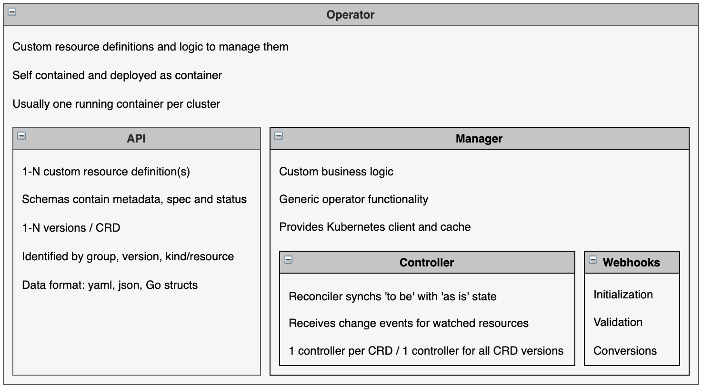

# operator-sample-go

This project contains Kubernetes operator samples that demonstrate best practices how to develop operators with [Golang](https://go.dev/), [Operator SDK](https://sdk.operatorframework.io/) including [Kubebuilder](https://github.com/kubernetes-sigs/kubebuilder) and the [Operator Lifecycle Manager Framework](https://operatorframework.io/).

### Setup

There are three ways to develop and run the operator:

1) [Local Go Operator](documentation/SetupLocal.md) 
2) [Kubernetes Operator manually deployed](documentation/SetupManualDeployment.md)
3) [Kubernetes Operator deployed via OLM](documentation/SetupDeploymentViaOLM.md)
    * via operator-sdk
    * via kubectl

### Documentation

* [The Kubernetes Operator Metamodel](http://heidloff.net/article/the-kubernetes-operator-metamodel/)
* [Creating and updating Resources from Operators](http://heidloff.net/article/updating-resources-kubernetes-operators/)
* [Deleting Resources in Operators](http://heidloff.net/article/deleting-resources-kubernetes-operators/)
* [Storing State of Resources with Conditions](http://heidloff.net/article/storing-state-status-kubernetes-resources-conditions-operators-go/)
* [Finding out the Kubernetes Versions and Capabilities in Operators](http://heidloff.net/article/finding-kubernetes-version-capabilities-operators/)
* [Importing Go Modules in Operators](http://heidloff.net/article/importing-go-modules-kubernetes-operators/)
* [Accessing third Party Custom Resources in Go Operators](http://heidloff.net/article/accessing-third-party-custom-resources-go-operators/)
* [Using object-oriented Concepts in Golang based Operators](http://heidloff.net/article/object-oriented-concepts-golang/)
* [Manually deploying Operators to Kubernetes](http://heidloff.net/article/manually-deploying-operators-to-kubernetes/)
* [Deploying Operators with the Operator Lifecycle Manager](http://heidloff.net/article/deploying-operators-operator-lifecycle-manager-olm/)
* [Defining Dependencies in Operators](http://heidloff.net/article/defining-dependencies-kubernetes-operators/)
* [Configuring Webhooks for Operators](http://heidloff.net/article/configuring-webhooks-kubernetes-operators/)
* [Initialization and Validation Webhooks in Operators](http://heidloff.net/article/developing-initialization-validation-webhooks-kubernetes-operators/)
* [Converting Custom Resource Versions in Operators](http://heidloff.net/article/converting-custom-resource-versions-kubernetes-operators/)
* [How to build your own Database on Kubernetes](http://heidloff.net/article/how-to-build-your-own-database-on-kubernetes/)

To start developing operators, we recommend to get familiar with the [Kubernetes Operator Metamodel](http://heidloff.net/article/the-kubernetes-operator-metamodel/) first.

### Resources

* [Operator SDK Documentation](https://sdk.operatorframework.io/docs/overview/)
* [Kubebuilder Book](https://book.kubebuilder.io/)
* [Operator Framework (OLM) Documentation](https://olm.operatorframework.io/docs/)
* [Intro to the Operator Lifecycle Manager](https://www.youtube.com/watch?v=5PorcMTYZTo)
* [Go Modules](https://www.youtube.com/watch?v=Z1VhG7cf83M)
* [Resources to build Kubernetes Operators](http://heidloff.net/articles/resources-to-build-kubernetes-operators/)
* [Kubernetes API Conventions](https://github.com/kubernetes/community/blob/master/contributors/devel/sig-architecture/api-conventions.md)
* [Quarkus sample](https://github.com/nheidloff/quarkus-operator-microservice-database)
