# Demonstration Script

Use this section as a guide to give a live demo of the operator-sample-go asset on OpenShift.  The following topics are included:

* OpenShift OperatorHub and OLM
* Deployment via OperatorHub
* Auto backup
* Auto scalability and Metrics

## Setup

* First install the [prerequistes](Prerequisites.md)
* Install all demo components using the provided [script](../scripts/README.md), use command ```sh scripts/demo-openshift-operators.sh app demo reset``` 
* Create a Cloud Object Storage (COS) Bucket and add Secrets for accessing it. [Setup Cloud Object Storage](cos.md)
* Create a Route to the /hello enpoint for the microservice pod in application-beta

**Note that after following the install setps, you will need to reverse some of the deployment steps as they are intended to be performed live in the demo script below.**

* Uninstall both operators (but leave Catalog sources), using OpenShift Console menu ```Installed Operators```
* Delete all CR instances: Application, Database, Databasecluster, Databasebackup (if present), using using OpenShift Console menu ```Administration->CustomResourceDefinitions```

## Introduction to our sample operators

We have created a repo containing two operators, you can find it on github.com.  

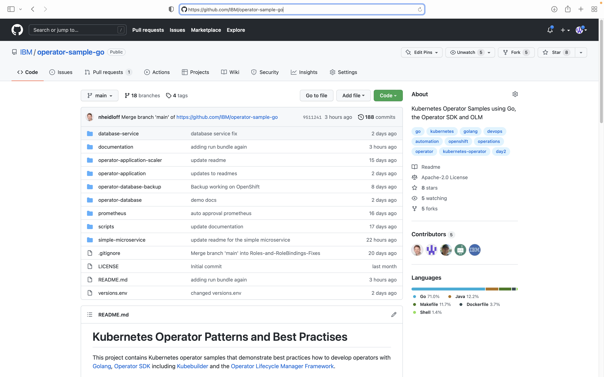

I'm going to use these samples to give a 15-20 minute demo which gives you an idea of:

* The Day 1 and Day 2 capabilities that the operators provide
* How to package, version and distribute an operator so that it appears in the OpenShift UI of your customers, making it easy for their administrators to discover and install the operator, to manage your solution’s workload
* Show the user experience of installing and managing software with operators vs. a standard approach using only standard Kuberenetes resources

The main capabilities of our sample operators are to deploy a web application server and a database.  In addition, the operators also monitor specific metrics to automate sclaing of the pods, and automate the task of performing a database backup to cloud object storage.  As you will see, the operator really abstracts all these tasks for the administrator - all these things can be achieved by creating just three short custom resources (defined in simple yaml files).  The operators actually deploy and mananage many standard kubernetes resources to meet the day 1 and day 2 goals I described.  I estimate at least 20 resources are created (deployments, statefulsets, pods, services, pvcs, cronjobs etc), just for our simple samples.  If your solution has many components, is stateful or requires various day 2 activities to keep it running, using an operator could be the difference between success or failure for your customers.

## OpenShift OperatorHub and OLM


Kubernetes includes an Operator Lifecycle Manager component which is used extensively by OpenShift to manage its own operators, and you can use it to manage your custom operator(s).  In the OpenShift UI console, you’ll find the OperatorHub.

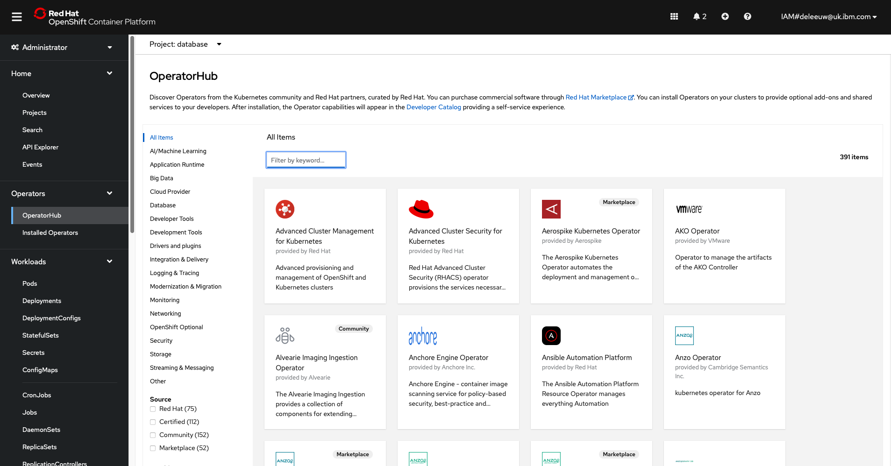

Each tile represents an operator which are visible in the UI of the thousands of OpenShift clusters, used by enterprises worldwide.  Currently, there are around 400 operators from RedHat, IBM and other ISVs and you can filter the operators in various ways.  The OperatorHub collates its contents from various sources (known as Catalogs).

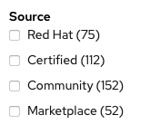

* Red Hat Operators - Red Hat products packaged and shipped by Red Hat.

* Certified Operators - Products from leading independent software vendors (ISVs), and there is a simple process with RedHat to verify the operator and solution meet their quality criteria.  

* Red Hat Marketplace – these are certified operators that are available to purchase via the Red Hat marketplace.

* Community Operators – these are open source operators from a specific github repo, into which it is very easy to add content.  These community operators also appear in another marketplace called OperatorHub.io.  Although this has a similar name to the OperatorHub in OpenShift, it’s a separate marketplace aimed at any Kubernetes platform.

It’s also possible to create your own catalog sources to represent all your operators if you have multiple solutions.  As you can see, in my cluster I have two custom catalog sources for some operators we have created as examples, one source contains apps the other a simple database, which I’ll show in a moment.  

IBM takes a similar catalog approach with its Cloud Paks software.  But first, let’s look at the purchasing experience for a commercial offering from CrunchyData.

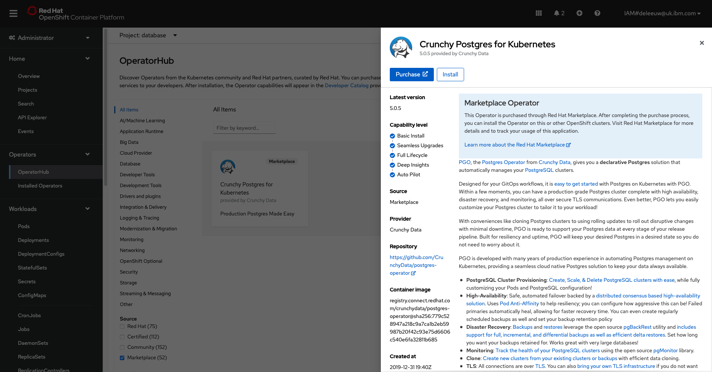

If I wanted to purchase Crunchy Postgres, I simply locate it in the OperatorHub and click the button to either Install or Purchase.  The fact that I can install without entitlement suggests there is a free trial available, which you can verify if you click Purchase, which directs you to the Red Hat Marketplace which can process transactions or look at the free trial terms.

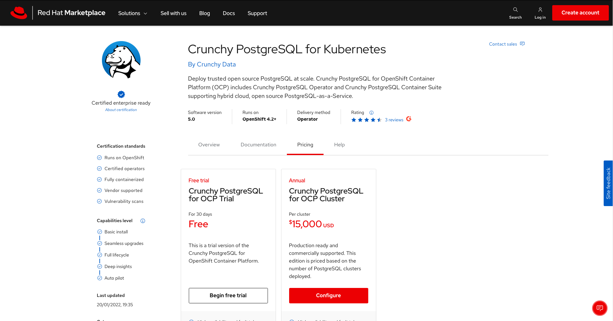

Returning to OperatorHub in OpenShift, let’s see what happens if we install this operator.

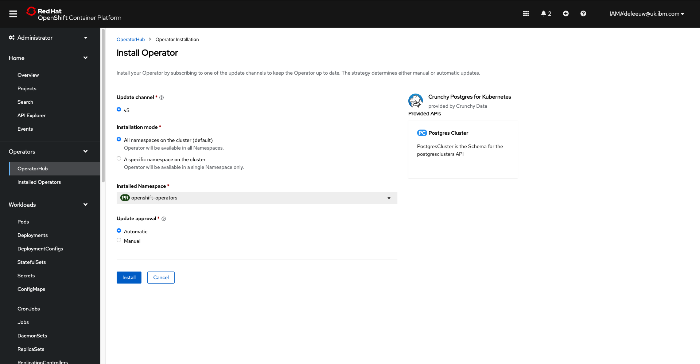

Here you can see the options to install the operator which can install and manage the Crunchy Postgres solution.  It’s very simple, and you only need to choose a namespace and decide if you want your cluster to automatically approve & install updates to the operator as they are published by the publisher.  

Remember, the operator doesn’t install the Crunchy Postgres database, it just deploys a container in which the operator is running.  The operator will spring into life when the administrator creates a custom resource on the cluster, just like you would for any standard Kubernetes resources like pods, or secrets etc.  

Let’s hold off on installing this commercial offering, and now work with a sample operator we created, which is responsible for deploying and managing our simple database.

## Deployment via OperatorHub

Before we install it with OLM, it’s important to understand how the packaging works.  To have your own operator included in any of the catalog sources we have looked at, it needs to be packaged according to the requirements of the Operator Lifecycle Manager, which in simplified terms looks like this:

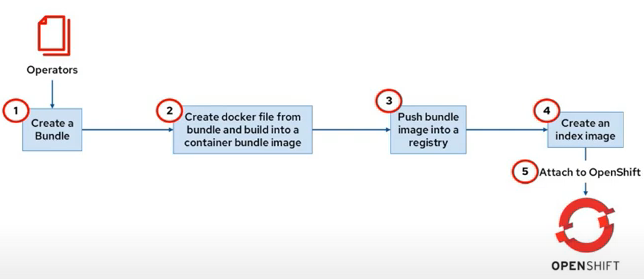

The bundle is a collection of files which includes a resource definition called a ClusterServiceVersion which describes the operator and where to find it in a registry, the manifests to create the CRDs the operator manages, and any dependencies such as other operators.  From the bundle, you must create a Dockerfile to build a minimal container containing the files, which is pushed to a registry.  Finally, you must create another container called the index image.  The existing (or additional/new) catalog sources derive their content from index images, as they provide an API which publishes the details of your bundle.  

If this all sounds a bit complicated, this is of course IBM Build Labs help you.  In addition, we use an open source tool called operator-sdk which not only helps to scaffold operators in Go (and other languages), but also helps automate these packaging steps too.

Once you have these packaging artifacts, what you do next depends on which catalog you want your operator to appear in, e.g. for RHM you would work with RedHat, for a community operator you would create a pull request and commit your bundle to the relevant open source repo, or you could simply provide the packaging artifacts directly to your customers (as I have done in this cluster)

I have already created the Catalog Sources, and the bundle, catalog and operator are in my dockerhub registry.  Therefore we we have a couple of operators ready to install.  

Let’s do that via the UI now (of course everything can be done via command line too), then I’ll explain what these operators deploy and manage.

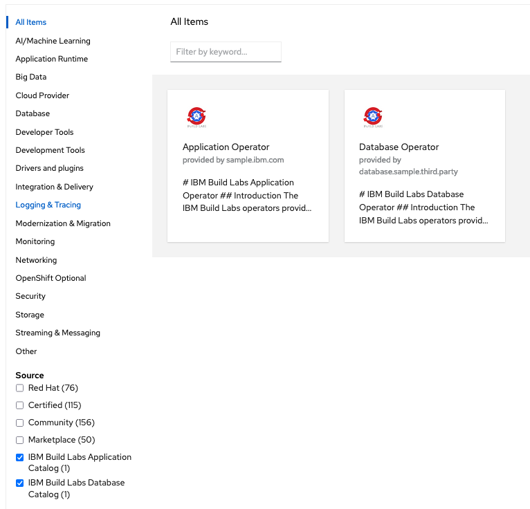

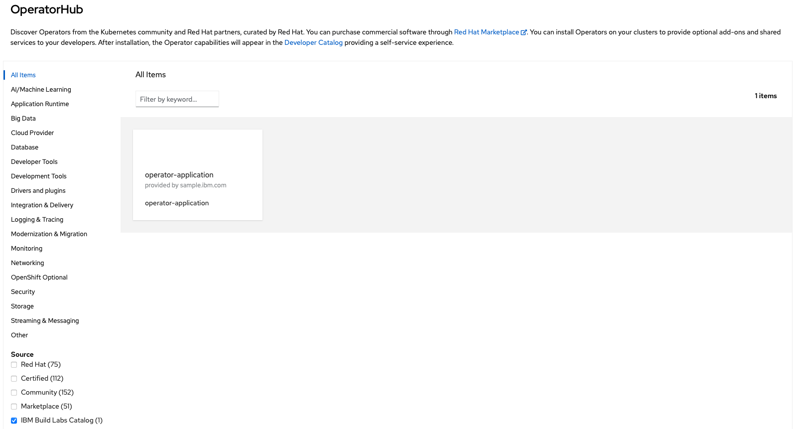

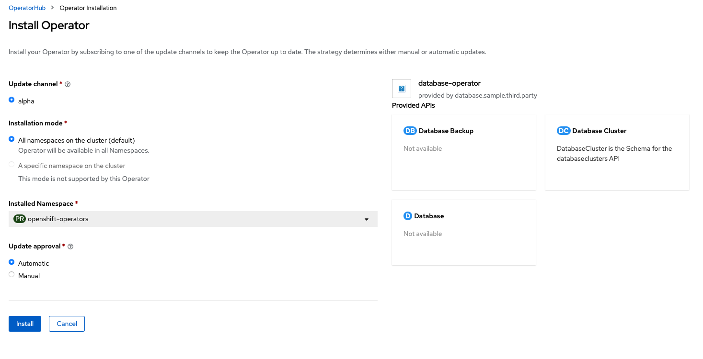

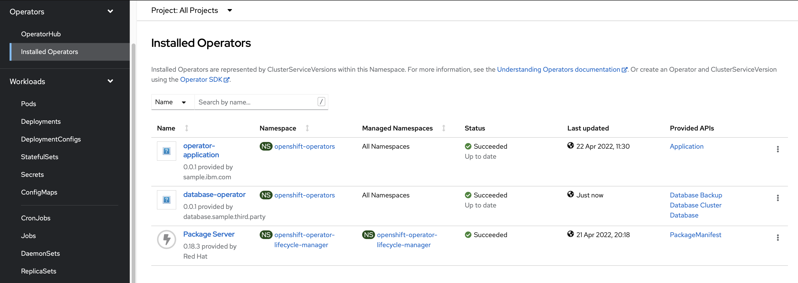

After initiating the install, the operators are deployed as containers from the registry defined in the bundle that the catalog feeds from.  So, what have we deployed?  Notice that each operator provides a number of APIs – these are custom extensions to the Kubernetes API, i.e. CRDs.

The database operator provides three APIs:

* The Cluster API/CRD allows for creating a ‘cluster’ of pods which simulate a typical database.  Each pod is managed by a stateful set, has some storage, and provides some APIs.  The database pods communicate with each other to establish one leader, to which data can be written and multiple followers/replicas which replicate the data for high availability. The database itself is just a sample, when called by an API, it writes a single json file to its associated persistent storage.

* The Database API/CRD instructs the database cluster to create a ‘database schema’, populated by the specified SQL file.  A real database may have other ways to create the schema.

* The Backup API/CRD is used to automate the day 2 operation of triggering a manual or scheduled backup of the data, to cloud object storage.  The operator encapsulates all the relevant know how to perform backups in a consistent and repeatable way. 

The application operator supports one API:

* The Application API/CRD creates a frontend web application by creating Kubernetes resources like secrets and deployments, and in addition, it uses the custom resources I just spoke about to create a ‘database schema’ (NB. It doesn't actually do this but this was the intention for this CR.  For now, the database is currently hardcoded with its data).  It’s even smart enough to know if that custom Database API/CRD has been installed to the cluster and will keep retrying until this dependency is satisfied.

Let’s try it.  In this first part of the demo we'll focus on the database.

To make the operator spring into life, we need to create some resources with a ‘kind’ that correlates to the CRD definitions the operators have already installed to the cluster.  These resources can be created manually via the operator’s UI, or you can create from a yaml file as most Kubernetes administrators would do.  Let’s apply the following yamls:

* The database cluster itself.  Note the kind is a custom resource, defined by our Database operator, and the fields are specific to our database application.  We don’t need to create lots of kuberenetes resources ourselves, the DatabaseCluster kind provides an abstraction.  We only need to give the database cluster a name, and define how many pods we want (1 leader, 2 followers in this case):

```
cat <<EOF | oc apply -f -
apiVersion: database.sample.third.party/v1alpha1
kind: DatabaseCluster
metadata:
  name: databasecluster-sample
  namespace: database
spec:
  image: docker.io/nheidloff/database-service:v1.0.62
  amountPods: 3
EOF
```

Now we have a database cluster which has populated itself with some default data, so we can test it right away.  Let’s test the database by calling its endpoint to return the data (from within the container's terminal as the endpoint is not externally exposed):

```
curl -s http://localhost:8089/persons
```

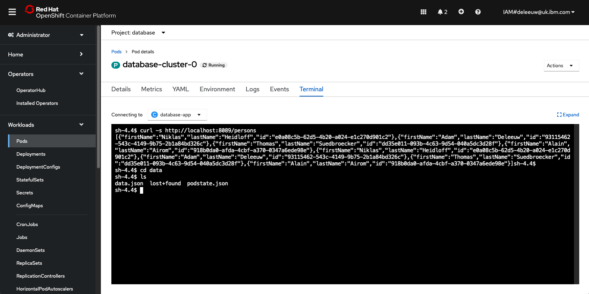


## Auto backup

What if we wanted to use an operator to automate the day 2 task of scheduling a backup, to copy the current data to Cloud Object Storage?  Instead of creating a script or runbook to be executed by a human, we can create a backup CR, which the database operator will process by creating a cron job which launches another ‘backup’ container on a schedule.  The backup container reads from the database cluster, connects to cloud object storage and performs the backup.  Let’s create the backup CR.  As you can see, it has optional properties to create either a manual backup, or create a scheduled backup, putting the data in the list of repos (COS in this case).

```
cat <<EOF | oc apply -f -
apiVersion: database.sample.third.party/v1alpha1
kind: DatabaseBackup
metadata:
  name: databasebackup-manual
  namespace: database
spec:
  image: docker.io/nheidloff/operator-database-backup:v1.0.46
  repos:
  - name: ibmcos-repo
    type: ibmcos
    secretName: ibmcos-repo
    serviceEndpoint: s3.eu.cloud-object-storage.appdomain.cloud
    cosRegion: eu-geo
    bucketNamePrefix: "database-backup-"
  manualTrigger:
    time: "2022-04-20T02:59:43.1Z"
    repo: ibmcos-repo
  scheduledTrigger:
    schedule: "0 * * * *"
    repo: ibmcos-repo
EOF
```

Once the CR has been processed by the operator, you’ll see it created a CronJob which launches a Job (a pod which runs to completion), every hour minutes.  Alternatively, you can trigger the job manually:

```
kubectl create job --from=cronjob/databasebackup-manual-cronjob manuallytriggered -n database
```

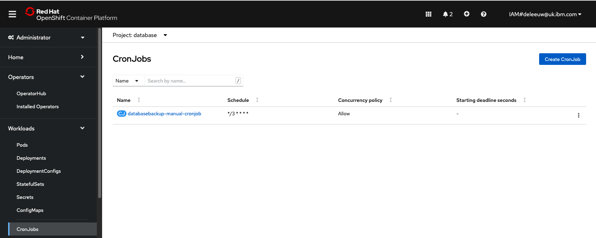

And if you look at the Jobs this CronJob creates, it launches container which calls our databases and backups the data to COS.

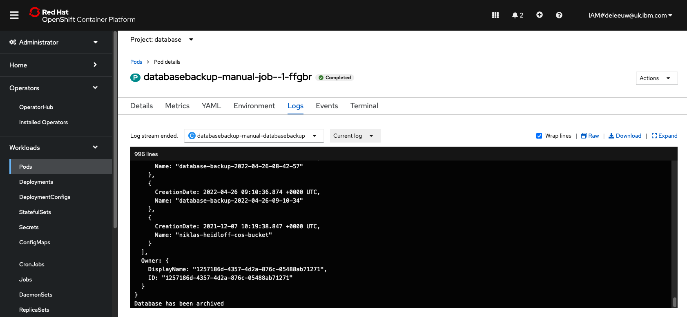

To prove it really works, you can even see the data in COS.

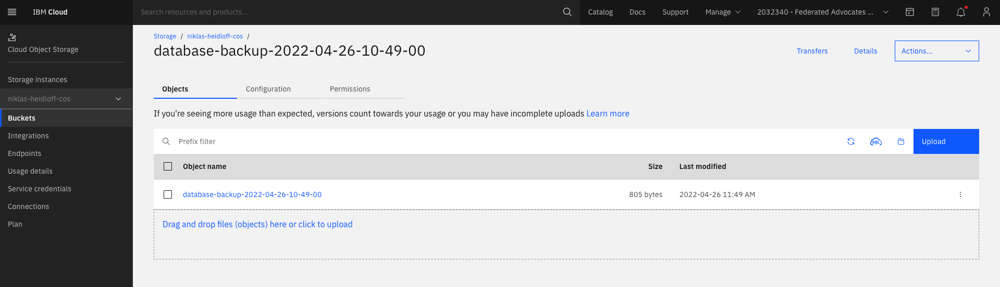

The data can be downloaded.

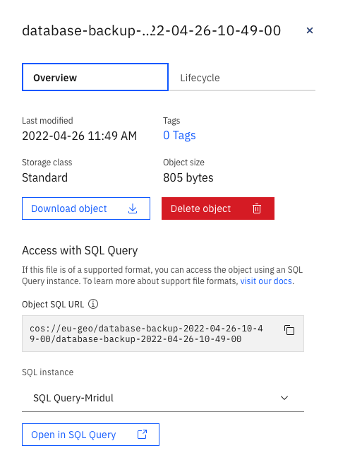


## Auto scalability and Metrics

## Work in progress

To test the auto scaler capabilities, let's first install and test our frontend application.

As with the database, its CR provides an abstraction, and it will take care of creating Kuberenetes resources to deploy a web app pod (providing a single API endpoint), and even use the database CR to create some data in our database cluster.

```
cat <<EOF | oc apply -f -
apiVersion: application.sample.ibm.com/v1beta1
kind: Application
metadata:
  name: application
  namespace: application-beta
spec:
  version: "1.0.0"
  amountPods: 1
  databaseName: database
  databaseNamespace: database
  title: people
  image: docker.io/nheidloff/simple-microservice:v1.0.46
EOF
```


After a few minutes you will see the application operator has created several components:

* A deployment consisting of a single pod (a web application written in Java).  The pod connects to our simple database, and renders a Hello World response to each name in the database
* A service to expose the web app (and for this demo, I also created an OpenShift Route so the web application is available externally)


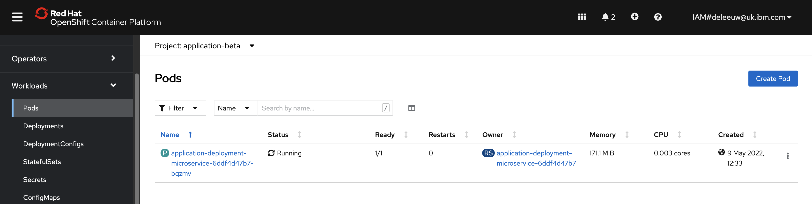

Let's take a look at the web app now by clicking the route and invoking the web app's only endpoint, /hello

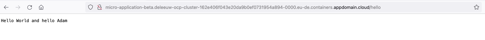

The web application also publishes metrics which are collected by Prometheus, which is installed by default on OpenShift.  In particular, our web application publishes how many times the /hello endpoint has been invoked, and the operator uses this to determine if the web application deployment should be scaled up.  This is quite a simple scenario, and to be honest you could achieve the same results with existing k8s capabilities like Horizontal Pod Autoscaler using custom metrics.  However, in our demo we don't use HPA, instead our application operator has created a Cronjob resource which launches a pod to query metrics collected by Prometheus.  If the number of invocations are more than five, our application scaler pod modifies our applications custom resource to define additional replicas, which our operator reconciles.

So let's see it in action.  If we look at the default Prometheus dashboard, we can query the metric exposed by our web application.  Search for ```application_net_heidloff_GreetingResource_countHelloEndpointInvoked_total```.

Right now it's one, so let's call the /hello endpoint to increase the metric to at least six.

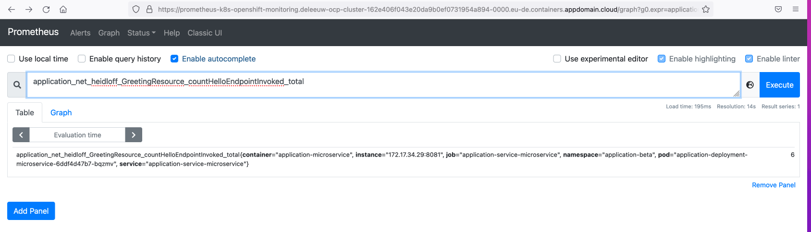

Our application operator has already created the Cronjob to launch a pod which makes the scaling decisions on a schedule.

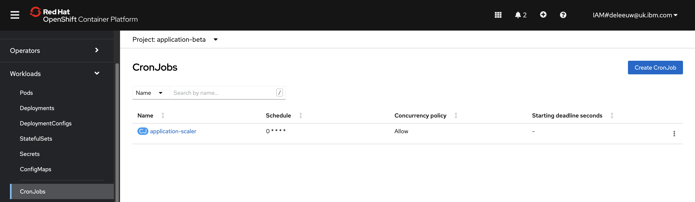

Before we look at the application scaler pod, let's verify how many pods are specified in the web application deployment.  Looking at the Application CR, you can see just one was specified, and that's exactly what the operator has reconciled when creating the k8s deployment.

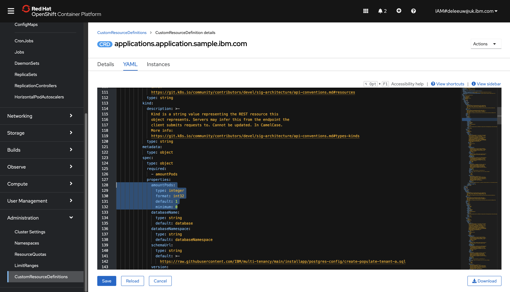
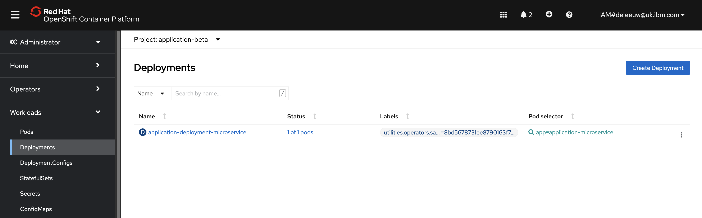

We can now either wait for the application scaler pof to trigger automatically on schedule, or better still, force it to trigger now.  

```
kubectl create job --from=cronjob/application-scaler manuallytriggered -n application-beta
```

If we look into the logs of the application scaler pod, we can see it has queried Prometheus and because the /hello metric is greater than six, the pod has used k8s API to modify the custom resource for our application.

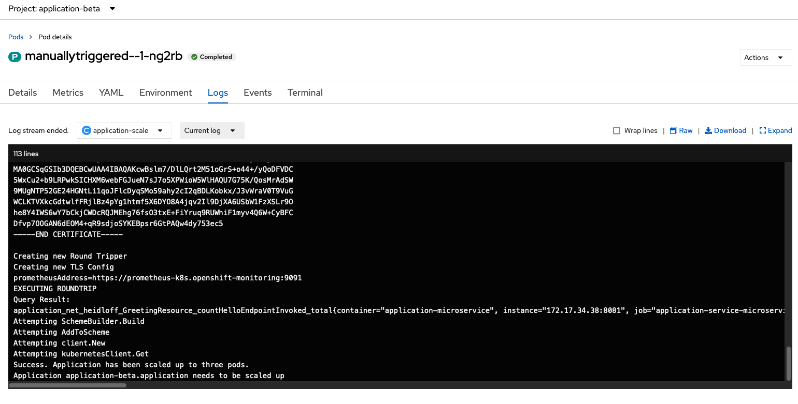

As you would expect, the application operator has responded to the change in the CR and we can verify this now.

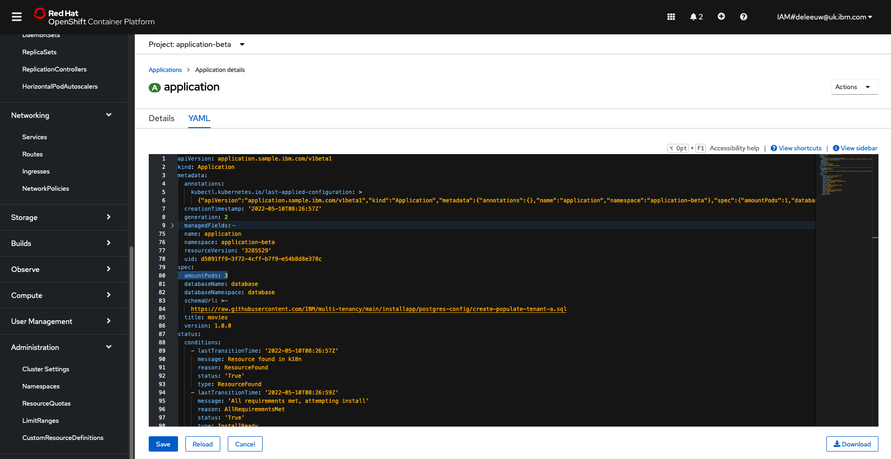
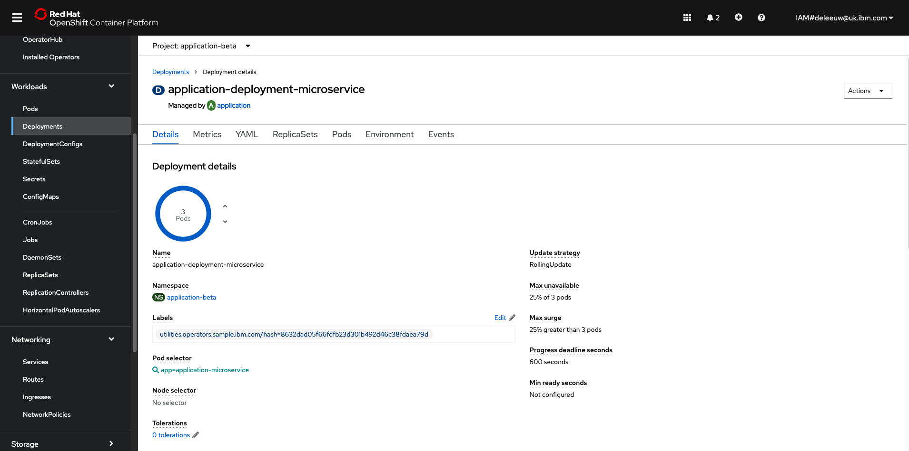
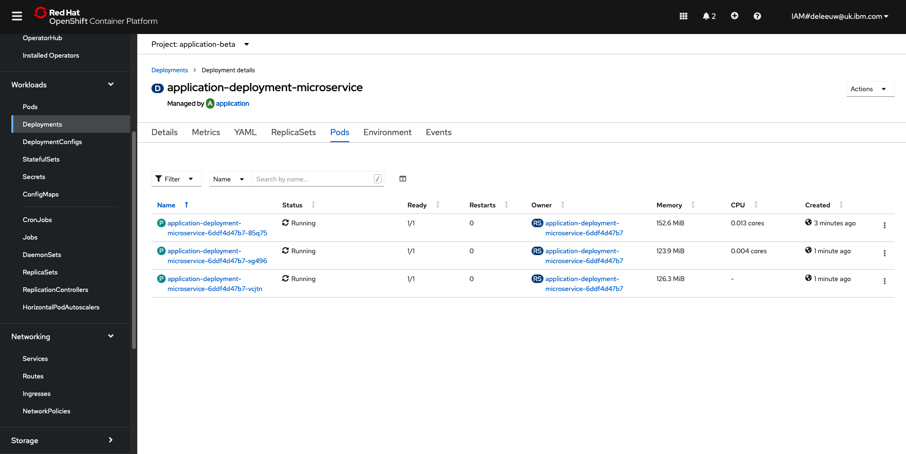

By having our own application scaler pod, the logic to control scaling is entirely flexible.  It is not bound to the metrics of just a single pod, it could query requests per mintue on the web app, assess queue depth from a messaging pod and consider the number of active connections to the database.

THE END


