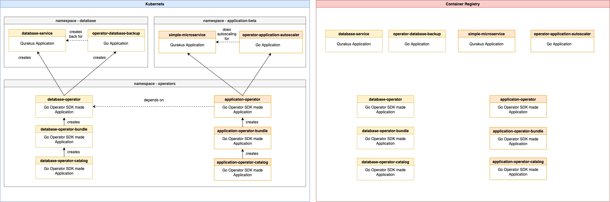
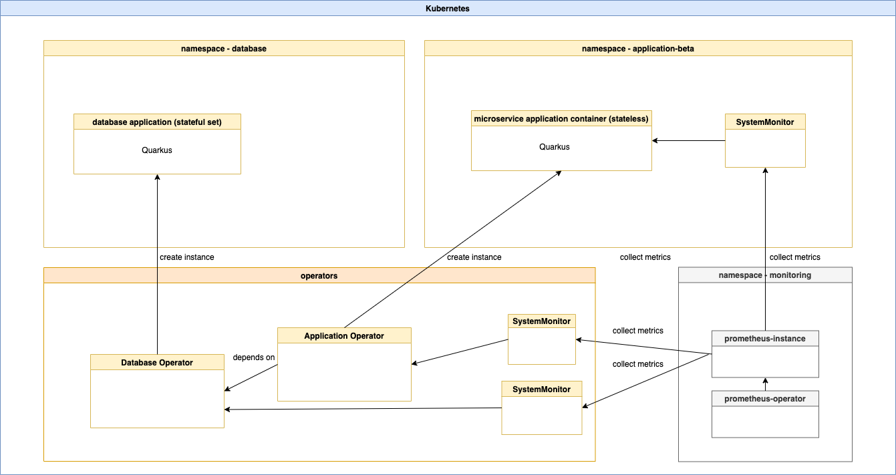

# Automation with scripts

> 🔴 IMPORTANT: **Don't commit any changes made by the script automation to the repository!** Only the persons who are responsible for the **golden source** are allowed to do that!

The documentation is structured in following sections.

1. Technical environment
2. The script automation
3. Types of scripts
4. Script parameters

### 1. Technical environment

> 🔴 IMPORTANT: For the [opm](https://github.com/operator-framework/operator-registry/blob/master/docs/design/opm-tooling.md#opm) tool installation please read the [blog post](https://suedbroecker.net/2022/04/28/make-generate-error-127/) or just copy the `bin` folder of an **existing project** `Operator SDK` project to the **cloned github project** directory, or run the available script automation in b).

| OS| Version | Tested |
| --- | ---  |  --- |
| macOS | 12.3.1 | OK |

| Operator | Cluster | Type | Region | Security Group | Public Gateway | Container Registry | Tested | Note |
| --- | --- | --- |  --- |  --- | --- | --- |  --- | --- |
| Database | Kubernetes (1.23.6_1527) | VPC | us-south  | Validated | Validated | `Quay.io` | OK | |
| Application (microservice) | Kubernetes (1.23.6_1527) | VPC | us-south | Validated | Validated | `DockerHub` |  Problems | Can't be pulled from DockerHub. Solution delete repo on DockerHub and recreate it. |


#### a) Verification of the prerequisites

All local installation versions are related to macOS.
You can run to verify the prerequisites [the following script](https://github.com/IBM/operator-sample-go/blob/main/scripts/check-prerequisites.sh). The scipt informs you if the tools are installed, but you need to verify the versions in the terminal output with the version in the following table.

```sh
sh scripts/check-prerequisites.sh
```

#### b) Setup of the needed executable `bin` files 

Setup of the needed `bin` files (`controller-gen`, `kustomize`,` opm`, `setup-envtest`) for the operator-sdk projects:

```sh
sh scripts/check-binfiles-for-operator-sdk-projects.sh
```

* Example output:

```sh
***  Bin folder status: operator-database
controller-gen  kustomize       opm             setup-envtest
***  Bin folder status: operator-database
controller-gen  kustomize       opm             setup-envtest
```

#### c) A Table with the tested version of tools and frameworks of the prerequsites

| Tools or frameworks | Version/s |  (G)obal, (L) ocal or (C)loud installed | Tested |
| --- | --- | --- |  --- |
| [Podman](https://podman.io/) Client / Server | 4.1.0 / 4.3.0 | G | OK |
| [Operator SDK](https://sdk.operatorframework.io/) | v1.18.0,  v1.18.1, v1.19.1 | G | OK |
| Go | go1.17.6 _(operator-sdk v1.18.0, v1.18.1 )_ (worked also with v1.19.1 ) | G | OK |
| Go | go1.17.8 _(operator-sdk v1.19.1)_ | G | NOT TESTED |
| Kubernetes cluster (VPC) | 1.23.6_1527 | C | OK |
| kubectl client | 1.23 | L | OK |
| kubectl server | v1.23.6+IKS | C | OK |
| oc server | 4.7.0 | C | OK |
| oc client | 4.10.9 | C | OK |
| operator-database/bin/[opm](https://github.com/operator-framework/operator-registry/blob/master/docs/design/opm-tooling.md#opm) | v1.21.0 | L | OK |
| operator-application/bin/[opm](https://github.com/operator-framework/operator-registry/blob/master/docs/design/opm-tooling.md#opm) | v1.21.0 | L | OK |
| bash | GNU bash, version 3.2.57(1)-release (x86_64-apple-darwin21)  | L | OK |
| sed | 12.3.1 | L | OK |
| awk | awk version 20200816 | L | OK |
| cURL | 7.79.1 | L | OK |
| grep | 2.6.0-FreeBSD | L | OK |
| tar | bsdtar 3.5.1 | L | OK |
| container registry | [DockerHub](https://hub.docker.com/), [Quay(Red Hat)](https://quay.io/) | C | OK |


| IBM Cloud Services used| Version | Tested |
| --- | ---  |  --- |
| [IBM Cloud Kubernetess Service](https://cloud.ibm.com/kubernetes/catalog/create) (on VPC)| v1.23.6+IKS |  OK |
| [IBM Cloud Object Storage](https://cloud.ibm.com/objectstorage/create) | TBD |  TBD |
| [IBM Cloud 'Virtual Private Cloud'](https://cloud.ibm.com/vpc-ext/provision/vpc) | TBD |  TBD |


### 2. The script automation

The following image shoew a simplified system overview of the system we are going to setup with the automation scripts.



The current script automation does following: 

> The functionality has variations depending on the script you are going to use.

1. It ensures that with two `versions.env` files the tagging for the container images works in a consistent way.
  
  *  [`versions.env`](https://github.com/IBM/operator-sample-go/blob/main/versions.env) for **golden sources**
  *  `versions_local.env` for **custom local configurations** your version of [`versions_local.env-template`](https://github.com/IBM/operator-sample-go/blob/main/versions_local.env-template)

2. It creates a temp `github tag` related to the last commit **before** the automation was started.

3. It creates a `script-automation.log` file which will not be load to the git repo.

4. Resets the cluster environment:

    * [OLM](https://olm.operatorframework.io/) installation
    * [Cert manager](https://cert-manager.io/docs/) installation
    * [Prometheus operator](https://github.com/prometheus-operator/prometheus-operator) installation
    * Clean the installed operators and application to that example

5. Creates following containers images:

    * `Database operator` related
        * [`Database-service`](https://github.com/IBM/operator-sample-go/tree/main/database-service) (_quarkus application_), a custom database which provides stateful sets
        * [`operator-database`](https://github.com/IBM/operator-sample-go/tree/main/operator-database) (operator), this operator creates an instance of the [`Database-service`](https://github.com/IBM/operator-sample-go/tree/main/database-service)
        * [`operator-database-backup`](https://github.com/IBM/operator-sample-go/tree/main/operator-database-backup) (_quarkus application_), this is an application which will be instantiated later from the [`operator-database`](https://github.com/IBM/operator-sample-go/tree/main/operator-database) to create a backup on an object storage database
        * `operator-database-bundle`, that is a container image which will be created by the operator-sdk and will be used later inside the `operator-database-catalog` which is relevant for the `OLM` usage.
        * `operator-database-catalog`, that container image contains a reference to the `operator-database-bundle` and will be used in the context of `OLM`

    * `Application operator` related
        * [`simple-microservice`](https://github.com/IBM/operator-sample-go/tree/main/simple-microservice) (_quarkus application_), a simple microservice to display messages and runs as a stateless application
        * [`operator-application-autoscaler`](https://github.com/IBM/operator-sample-go/tree/main/operator-application-scaler) (_go application_), that application implements a cron job to manage the scaling for the instances of the [`simple-microservice`](https://github.com/IBM/operator-sample-go/tree/main/simple-microservice) which were created by the [`operator-application`](https://github.com/IBM/operator-sample-go/tree/main/operator-application)  operator.
        * [`operator-application`](https://github.com/IBM/operator-sample-go/tree/main/operator-application) (operator), this operator creates an instance of the [`simple-microservice`](https://github.com/IBM/operator-sample-go/tree/main/simple-microservice)
        * `operator-application-bundle`, that is a container image which will be created by the operator-sdk and will be used later inside the `operator-application-catalog` which is relevant for the `OLM` usage.
        * `operator-application-catalog`, that container image contains a reference to the `operator-application-bundle` and will be used in the context of `OLM`

6. It ensures based on templates that the manual configuration for the [`operator-application` templates](https://github.com/IBM/operator-sample-go/tree/main/scripts/application-operator-templates) and [`operator-database` templates](https://github.com/IBM/operator-sample-go/tree/main/scripts/database-operator-templates) are right configured to be ready for OLM usage. There are templates for `Kubernetes` and for `OpenShift`.

7. Resets the `podman` vm if needed and starts podman.

8. It creates `role.yaml`, `role-binding.yaml`, `clusterserviceversion.yaml` and sample custom resources for the given operators, based on templates.

9. It verifies the pre-requisites.

10. Setup of the needed `bin` directory of the operator-sdk projects. (`controller-gen`,`kustomize`, `opm`,`setup-envtest`)

### 3. Types of scripts

There are five types of scripts:

* **check**
* **install-required**
* **demo**
* **ci**
* **delete**

#### a.  **install-required**-xxx-components.sh

* Definition: 
`xxx == Kubernetes or OpenShift`

* Table overview:

Installs the required components for Kubernetes or OpenShift.

| Component | Kubernetes | OpenShift **(not implemented yet)** |
| --- |  --- |  --- |
| CertManager | Yes |  Yes |
| OLM | Yes |  No |
| Prometheus Operator | Yes |  No |
| Prometheus Instance | Yes |  No |

#### b. **demo**-xxx-yyyy.sh

Setup or delete based on the **golden source versions** (version.env).

* Definition: 

`yyy == Kubernetes or OpenShift`
`xxx == delete or setup`

* Table overview:

| Name | Kubernetes | OpenShift **(not implemented yet)** |
| --- |  --- |  --- |
| **demo**-setup-kubernetes.sh | Yes | No  |
| **demo**-delete-kubernetes.sh | Yes |  No |

#### c.  **ci**-www-xxx-yyy-zzz.sh

* Definition: 

Creates all operators or specific operators of the project in Kubernetes or OpenShift.

* `www == create or delete`
* `xxx == operator or operators`
* `zzz == Kubernetes or OpenShift`

* Table overview:

Here is a list of available ci scripts.

| Name | Kubernetes | OpenShift **(not implemented yet)** | Creates Database Operator | Creates Application Operator|
| --- |  --- |  --- |  --- |  --- |
| **ci**-create-operator-database-kubernetes.sh | Yes | No  | Yes  | No  |
| **ci**-create-operator-application-kubernetes.sh | Yes |  No | No  | Yes  |
| **ci**-create-operators-kubernetes.sh | Yes |  No | Yes  | Yes  |
| **ci**-delete-operators-kubernetes.sh | Yes (under construction) |  No | Yes  | Yes  |

#### d.   **delete-everything**-xxx

Deletes all depending on the Platfrom such as the operators, OLM, Prometheus or Cert-Manager.

* `xxx == Kubernetes or OpenShift`

#### e.   **check**-prerequistes.sh

Verifies, if the tools and the frameworks mentioned above are installed.

#### f.   **check**-check-binfiles-for-operator-sdk-projects.sh

Verifies the setup of the needed `bin` files (`controller-gen`, `kustomize`,` opm`, `setup-envtest`) for the operator-sdk projects.

### 4. Script parameters

> 🔴 IMPORTANT: The order of the parameters is hard coded!

#### a. ci-create-operators-kubernetes.sh

That scripts creates the operators in Kubernetes and has following parameter options.

* Kubernetes

| Parameter combination | versions.env  |  versions_local.env | delete all and setup prerequisites | creates `operator database` | creates `operator application` | reset podman |
| --- |  --- | --- | --- |  --- | --- | --- |
| `database` `local` |  no | yes | no | yes | no | no |
| `database` `local` `reset` |  no | yes |yes | yes | no | no |
| `database` `local` `reset` `podman_reset` |  no | yes |yes | yes | no | yes |
| `app` `local` |  no | yes | no | yes | yes | no |
| `app` `local` `reset` |  no | yes |yes | yes | yes | no |
| `app` `local` `reset` `podman_reset` |  no | yes |yes | yes | yes | yes |


* First parameter: ('database' or 'app')

    * Use 'database' for setup the database operator only
    * Use 'app' for setup the database and application operator.

* Second parameter: ('local' or 'ci')

    * Use 'local' for using the `versions_local.env` file as input for the container tags.

    * Use 'ci' for using the `versions.env` file as input for the container tags. **ONLY FOR GOLDEN SOURCE!**

* Third parameter: ('reset')

    * Use 'reset' to deinstall the operators and prereq and reinstall them.

* Fourth parameter: ('podman_reset')

    * Use 'podman_reset' to delete podman vm, create a new podman vm with size of 15, and start podman.


#### Example invokation:

* `database` - The script does create all container images related to the `database-operator`
* `local` - The script uses `versions_local.env` as input for the environment variables.
* `reset` - Deletes all Kubernetes components related to the example: `olm`, `cert-manager`, `prometheus-operator`, `database-operator` and ` application-operator`
`podman_reset` - Reset the podman vm by deleting the default-vm and create one with the size of 15 gig and start podman.

```sh
sh scripts/ci-create-operators-kubernetes.sh database local reset podman_reset
```

#### Example architecture:


